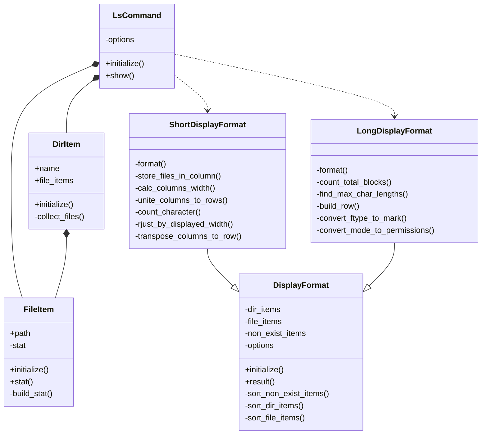

```mermaid
classDiagram
  class LsCommand {
    -options
    +initialize()
    +show()
  }

  class DirItem {
    +name
    +file_items
    +initialize()
    -collect_files()
  }

  class FileItem {
    +path
    -stat
    +initialize()
    +stat()
    -build_stat()
  }

  class DisplayFormat {
    -dir_items
    -file_items
    -non_exist_items
    -options
    +initialize()
    +result()
    -sort_non_exist_items()
    -sort_dir_items()
    -sort_file_items()
  }

  class ShortDisplayFormat {
    -format()
    -store_files_in_column()
    -calc_columns_width()
    -unite_columns_to_rows()
    -count_character()
    -rjust_by_displayed_width()
    -transpose_columns_to_row()
  }

  class LongDisplayFormat {
    -format()
    -count_total_blocks()
    -find_max_char_lengths()
    -build_row()
    -convert_ftype_to_mark()
    -convert_mode_to_permissions()
  }

  LsCommand *-- DirItem
  LsCommand *-- FileItem
  DirItem *-- FileItem
  LsCommand ..> ShortDisplayFormat
  LsCommand ..> LongDisplayFormat
  ShortDisplayFormat --|> DisplayFormat
  LongDisplayFormat --|> DisplayFormat
```
